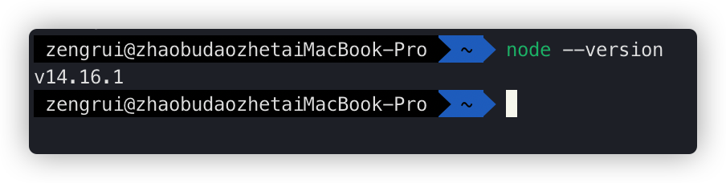
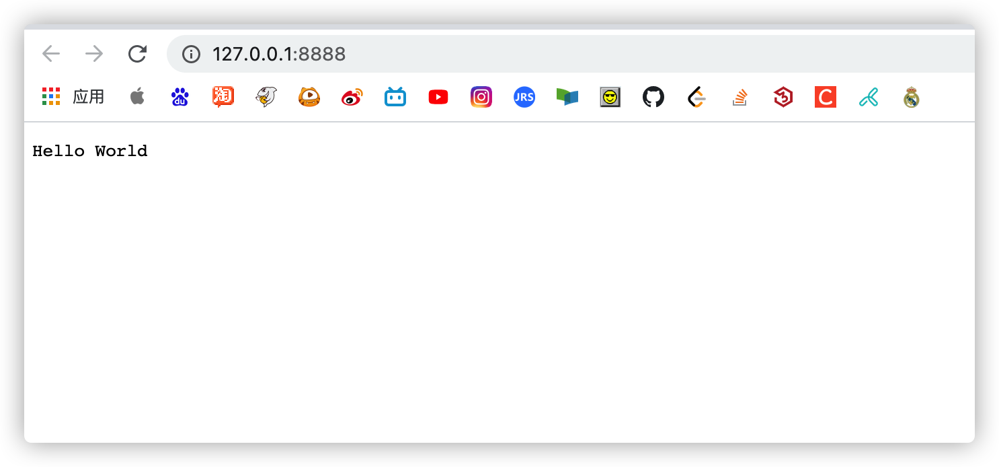
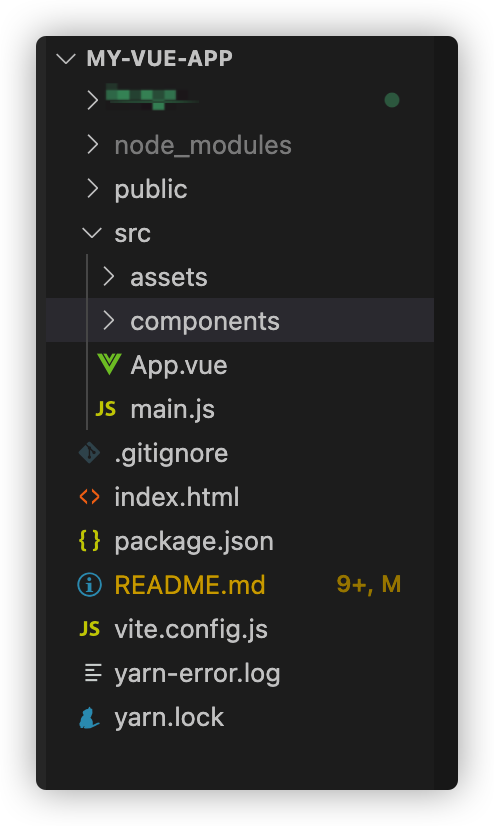
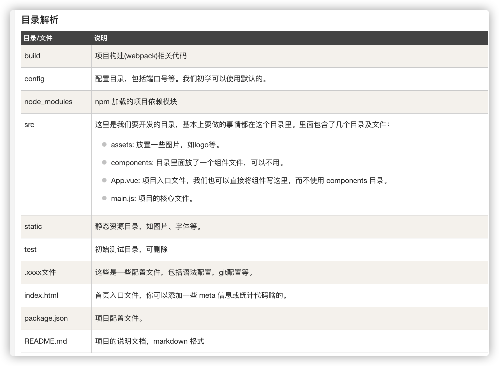
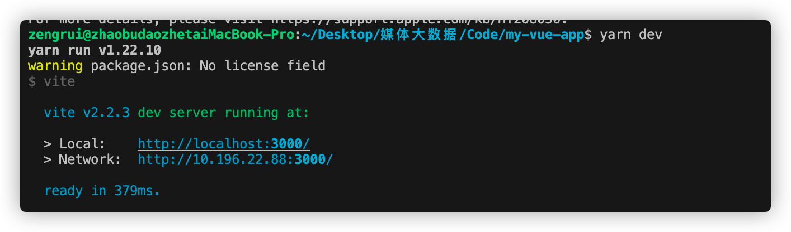
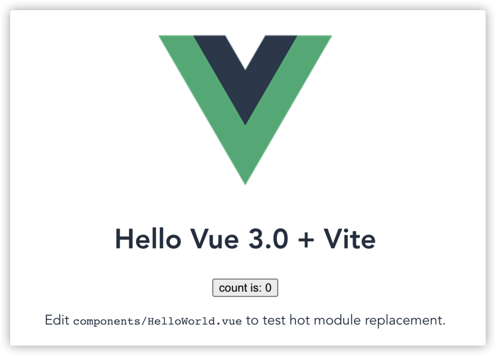
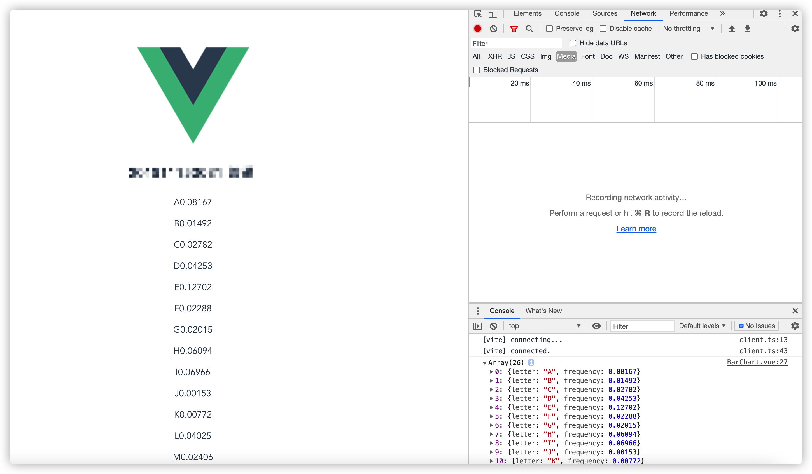
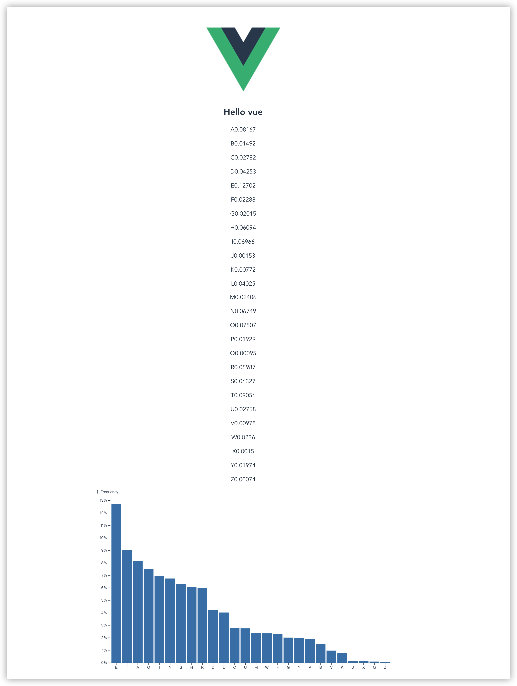

# 基于Vue和Vite的D3数据可视化学习

> 本项目用于入门学习Vue和Vite的搭建，同时使用D3实现数据可视化。

## 目录
- [准备阶段](#准备阶段)
  - [Node.js](#Node.js)
  - [yarn](#yarn)
  - [git](#git)
- [Vite站](#Vite站)
- [Vue+D3可视化](#Vue+D3可视化)
- [效果](#效果)
- [参考资料](#参考资料)

## 准备阶段

在搭建vue之前，我们需要先进行一下准备活动，搭建好环境,安装好某些命令。

### Node.js

> 简单来说，Node.js就是一个运行在服务端的JavaScript

[Node下载地址](http://nodejs.cn/download/)
下载并安装好之后，可以打开终端，输入命令查看是否安装成功

``` bash
node --version
```



创建JS文件server.js

``` javascript
var http=require("http");

http.createServer(function(request,response){
    response.writeHead(200,{'Content-Type':'text/plain'});

    response.end('Hello World\n');
}).listen(8888);

console.log('Sever running at http://127.0.01:8888/');
```

进入server.js的文件目录，运行文件


点开网址，成功显示


### yarn
执行命令安装 yarn

``` bash
npm install -g yarn
```

同时，你也可以用npm run来代替yarn，后续命令将会用yarn来实现

### git
git是程序员必须熟练运用的命令，在此不多赘述
mac用户可以执行命令来安装git

``` bash
brew install git
```

git的入门教学：
- https://www.jianshu.com/p/7edb6b838a2e
- https://www.jianshu.com/p/ef1ff4c21452

## Vite站
环境配置好之后，就可以正式搭建vite站了

- 初始化（创建）项目

``` bash
yarn create vite-app <project-name>
# 或者
npm init vite-app <project-name>
```

在此 project-name 为 **vue-d3-demo**

- 进入项目文件夹

``` bash
cd vue-d3-demo
```

可以通过 code . 的方式在VScode中快速打开文件夹：https://juejin.cn/post/6844903872989757447

- 安装依赖

``` bash
yarn
```

- 启动项目

``` bash
yarn dev
```
至此，项目就已经搭建好了



点开默认地址，http://localhost:3000/， 应该有以下效果

方便的是，如果编辑网站代码，那么更新地内容会实时同步在网页上，不用再刷新以查看效果（说的就是tomcat）。

## Vue+D3可视化
vite站点搭建好之后，我们使用D3简单地来做一个demo

- 安装D3依赖

``` bash
yarn add d3
```

- 安装Axios

> 在告别了 JQuery 时代，我们可以使用 axios 这一目前最为流行（没有之一）的 HTTP 请求库来请求咱们事先准备好的 JSON 数据

``` bash
yarn add axios
```

- 准备数据

我们在目录**public**里创建json文件：[test.json](./public/test.json)

在 **src/components** 文件夹下新建 **BarChart.vue** 文件。

``` html
<template>
    <h2>直方图</h2>
    <div id="bar-chart-container">
    <!--定义一个 bar-chart-container 的容器，以供 D3 操作。-->
      <p v-for="(char, i) in alphabet" :key="i">
        <span>{{ char.letter }}</span>
        <span>{{ char.frequency }}</span>
        <!--打印出json数据-->
      </p>
    </div>
</template>

<script>
  import axios from "axios";
  export default {
    /**
     * 在挂载后即开始执行
     */
    mounted() {
      axios.get("./test.json").then((res) => {
        console.log(res.data);
      });
    },
  };
</script>
```

并在 **src/App.vue** 中加载该组件。
``` html
<template>
  
  <!--HelloWorld msg="Hello Vue 3 + Vite" /-->
  <BarChart />
</template>

<script>
import BarChart from "./components/BarChart.vue";
export default {
  name:"App",
  components:{
    BarChart,
  },
};
// This starter template is using Vue 3 experimental <script setup> SFCs
// Check out https://github.com/vuejs/rfcs/blob/script-setup-2/active-rfcs/0000-script-setup.md
</script>

<style>
#app {
  font-family: Avenir, Helvetica, Arial, sans-serif;
  -webkit-font-smoothing: antialiased;
  -moz-osx-font-smoothing: grayscale;
  text-align: center;
  color: #2c3e50;
  margin-top: 60px;
}
</style>
```
此时网页已经同步出数据了


- 绘制直方图
此处为D3数据可视化知识，因此在这里不多赘述，贴上代码
``` html
<script>
  export default {
    data() {
      return {
        color: "steelblue",
        margin: { top: 30, right: 0, bottom: 30, left: 40 },
      };
    },

    mounted(){
      ...
    },

    methods: {
      drawBarChart(data) {
        ...
      },
    },
  };
</script>
```

``` d
drawBarChart(data) {
      const margin = this.margin;

      const width = 800;
      const height = 500;

      // 初始化 SVG 元素
      const svg = d3
        .select("#bar-chart-container")
        .append("svg")
        .attr("class", "bar-chart")
        .attr("viewBox", `0 0 ${width} ${height}`)
        .attr("width", width)
        .attr("height", height)
        .append("g");

      // https://observablehq.com/@d3/d3-scaleband
      // x 轴的缩放比例尺
      const x = d3
        .scaleBand()
        .domain(d3.range(data.length))
        .range([margin.left, width - margin.right])
        .padding(0.1);

      // y 轴的缩放比例尺
      const y = d3
        .scaleLinear()
        .domain([0, d3.max(data, (d) => d.value)])
        .nice()
        .range([height - margin.bottom, margin.top]);

      // x 坐标轴
      // tickSizeOuter(0) 移除 0 处初始的标记
      // tickFormat https://github.com/d3/d3-scale/blob/master/README.md#tickFormat
      const xAxis = (g) =>
        g.attr("transform", `translate(0,${height - margin.bottom})`).call(
          d3
            .axisBottom(x)
            .tickFormat((i) => data[i].name)
            .tickSizeOuter(0)
        );

      // y 坐标轴
      const yAxis = (g) =>
        g
          .attr("transform", `translate(${margin.left},0)`)
          .call(d3.axisLeft(y).ticks(null, data.format))
          // 移除区域间的竖线
          .call((g) => g.select(".domain").remove())
          .call((g) =>
            g
              .append("text")
              .attr("x", -margin.left)
              .attr("y", 10)
              .attr("fill", "currentColor")
              .attr("text-anchor", "start")
              .text(data.y)
          );

      svg
        .append("g")
        .attr("fill", this.color)
        .selectAll("rect")
        .data(data)
        .join("rect")
        .attr("x", (d, i) => x(i))
        .attr("y", (d) => y(d.value))
        .attr("height", (d) => y(0) - y(d.value))
        .attr("width", x.bandwidth());

      // 绘制到 SVG
      svg.append("g").call(xAxis);
      svg.append("g").call(yAxis);
    },
```

对此前的数据（这是一个英文字母使用频率的统计）进行简单的格式化：

``` d
<script>
  export default {
    ...,
    methods: {
      /**
       * 格式化数据
       */
      formatData(data) {
        return data
          .map(({ letter, frequency }) => {
            return { name: letter, value: frequency };
          })
          .sort((a, b) => d3.descending(a.value, b.value));
      },
      drawBarChart(data) {...},
    },
  };
</script>
```
最后在 **mounted** 中执行我们定义好的各个函数即可看到我们想要的直方图效果。
``` d
<script>
  export default {
    /**
     * 在挂载后即开始执行
     */
    mounted() {
      axios.get("./alphabet.json").then((res) => {
        const barChartData = Object.assign(this.formatData(res.data), {
          format: "%",
          y: "↑ Frequency",
        });
        this.drawBarChart(barChartData);
      });
    },
  };
</script>
```
## 效果


到此，基于Vue和Vite的D3数据可视化入门学习就结束了，初探之后，还有很多知识技术待我们去探索，加油吧。

## 参考资料
[从 Vite 与 Vue 开始的 D3 数据可视化之旅](https://www.yunyoujun.cn/posts/vue-d3-demo/)

[Vue.js 目录结构](https://www.runoob.com/vue2/vue-directory-structure.html)

[vue.js](https://cn.vuejs.org/v2/guide/installation.html)
